# Two Shuffles Make a RAM: Improved Constant Overhead Zero Knowledge RAM

Yibin Yang, Georgia Tech

David Heath, UIUC

Georgia Tech

UNIVERSITYOF

ILLINOIS

URBANA-CHAMPAIGN

# Zero-Knowledge Proof [GMR85]

# Zero-Knowledge Proof [GMR85]

natural_image

Simple cartoon-style head icon with black hair and orange background (no text or symbols)

Verifi er

natural_image

Simple cartoon illustration of a girl with pigtails and green bandages (no text or symbols)

Prover

# Zero-Knowledge Proof [GMR85]

<table><tr><td>5</td><td>3</td><td></td><td></td><td>7</td><td></td><td></td><td></td><td></td></tr><tr><td>6</td><td></td><td></td><td>1</td><td>9</td><td>5</td><td></td><td></td><td></td></tr><tr><td></td><td>9</td><td>8</td><td></td><td></td><td></td><td></td><td>6</td><td></td></tr><tr><td>8</td><td></td><td></td><td></td><td>6</td><td></td><td></td><td></td><td>3</td></tr><tr><td>4</td><td></td><td></td><td>8</td><td></td><td>3</td><td></td><td></td><td>1</td></tr><tr><td>7</td><td></td><td></td><td></td><td>2</td><td></td><td></td><td></td><td>6</td></tr><tr><td></td><td>6</td><td></td><td></td><td></td><td></td><td>2</td><td>8</td><td></td></tr><tr><td></td><td></td><td></td><td>4</td><td>1</td><td>9</td><td></td><td></td><td>5</td></tr><tr><td></td><td></td><td></td><td></td><td>8</td><td></td><td></td><td>7</td><td>9</td></tr></table>

Statement

natural_image

Simple cartoon-style head icon with black hair and orange background (no text or symbols)

Verifi er

natural_image

Simple cartoon illustration of a girl with pigtails and green bandages (no text or symbols)

Prover

# Zero-Knowledge Proof [GMR85]

<table><tr><td>5</td><td>3</td><td></td><td></td><td>7</td><td></td><td></td><td></td><td></td></tr><tr><td>6</td><td></td><td></td><td>1</td><td>9</td><td>5</td><td></td><td></td><td></td></tr><tr><td></td><td>9</td><td>8</td><td></td><td></td><td></td><td></td><td>6</td><td></td></tr><tr><td>8</td><td></td><td></td><td></td><td>6</td><td></td><td></td><td></td><td>3</td></tr><tr><td>4</td><td></td><td></td><td>8</td><td></td><td>3</td><td></td><td></td><td>1</td></tr><tr><td>7</td><td></td><td></td><td></td><td>2</td><td></td><td></td><td></td><td>6</td></tr><tr><td></td><td>6</td><td></td><td></td><td></td><td></td><td>2</td><td>8</td><td></td></tr><tr><td></td><td></td><td></td><td>4</td><td>1</td><td>9</td><td></td><td></td><td>5</td></tr><tr><td></td><td></td><td></td><td></td><td>8</td><td></td><td></td><td>7</td><td>9</td></tr></table>

Statement

<table><tr><td>5</td><td>3</td><td>4</td><td>6</td><td>7</td><td>8</td><td>9</td><td>1</td><td>2</td></tr><tr><td>6</td><td>7</td><td>2</td><td>1</td><td>9</td><td>5</td><td>3</td><td>4</td><td>8</td></tr><tr><td>1</td><td>9</td><td>8</td><td>3</td><td>4</td><td>2</td><td>5</td><td>6</td><td>7</td></tr><tr><td>8</td><td>5</td><td>9</td><td>7</td><td>6</td><td>1</td><td>4</td><td>2</td><td>3</td></tr><tr><td>4</td><td>2</td><td>6</td><td>8</td><td>5</td><td>3</td><td>7</td><td>9</td><td>1</td></tr><tr><td>7</td><td>1</td><td>3</td><td>9</td><td>2</td><td>4</td><td>8</td><td>5</td><td>6</td></tr><tr><td>9</td><td>6</td><td>1</td><td>5</td><td>3</td><td>7</td><td>2</td><td>8</td><td>4</td></tr><tr><td>2</td><td>8</td><td>7</td><td>4</td><td>1</td><td>9</td><td>6</td><td>3</td><td>5</td></tr><tr><td>3</td><td>4</td><td>5</td><td>2</td><td>8</td><td>6</td><td>1</td><td>7</td><td>9</td></tr></table>

Witness

natural_image

Simple cartoon-style head icon with black and orange coloring (no text or symbols)

V

This puzzle has a solution

natural_image

Illustration of a girl's face with brown pigtails and green bandages (no text or symbols)

P

# Zero-Knowledge Proof [GMR85]

<table><tr><td>5</td><td>3</td><td></td><td></td><td>7</td><td></td><td></td><td></td><td></td></tr><tr><td>6</td><td></td><td></td><td>1</td><td>9</td><td>5</td><td></td><td></td><td></td></tr><tr><td></td><td>9</td><td>8</td><td></td><td></td><td></td><td></td><td>6</td><td></td></tr><tr><td>8</td><td></td><td></td><td></td><td>6</td><td></td><td></td><td></td><td>3</td></tr><tr><td>4</td><td></td><td></td><td>8</td><td></td><td>3</td><td></td><td></td><td>1</td></tr><tr><td>7</td><td></td><td></td><td></td><td>2</td><td></td><td></td><td></td><td>6</td></tr><tr><td></td><td>6</td><td></td><td></td><td></td><td></td><td>2</td><td>8</td><td></td></tr><tr><td></td><td></td><td></td><td>4</td><td>1</td><td>9</td><td></td><td></td><td>5</td></tr><tr><td></td><td></td><td></td><td></td><td>8</td><td></td><td></td><td>7</td><td>9</td></tr></table>

Statement

<table><tr><td>5</td><td>3</td><td>4</td><td>6</td><td>7</td><td>8</td><td>9</td><td>1</td><td>2</td></tr><tr><td>6</td><td>7</td><td>2</td><td>1</td><td>9</td><td>5</td><td>3</td><td>4</td><td>8</td></tr><tr><td>1</td><td>9</td><td>8</td><td>3</td><td>4</td><td>2</td><td>5</td><td>6</td><td>7</td></tr><tr><td>8</td><td>5</td><td>9</td><td>7</td><td>6</td><td>1</td><td>4</td><td>2</td><td>3</td></tr><tr><td>4</td><td>2</td><td>6</td><td>8</td><td>5</td><td>3</td><td>7</td><td>9</td><td>1</td></tr><tr><td>7</td><td>1</td><td>3</td><td>9</td><td>2</td><td>4</td><td>8</td><td>5</td><td>6</td></tr><tr><td>9</td><td>6</td><td>1</td><td>5</td><td>3</td><td>7</td><td>2</td><td>8</td><td>4</td></tr><tr><td>2</td><td>8</td><td>7</td><td>4</td><td>1</td><td>9</td><td>6</td><td>3</td><td>5</td></tr><tr><td>3</td><td>4</td><td>5</td><td>2</td><td>8</td><td>6</td><td>1</td><td>7</td><td>9</td></tr></table>

Witness

natural_image

Simple cartoon-style head icon with black and orange coloring (no text or symbols)

V

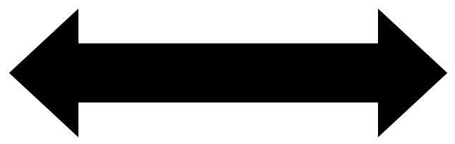

natural_image

Black double-headed arrow pointing left and right (no text or symbols)

natural_image

Illustration of a girl's face with brown pigtails and green bandages (no text or symbols)

P

This puzzle has a solution

# Zero-Knowledge Proof [GMR85]

text_image

!
V

<table><tr><td>5</td><td>3</td><td></td><td></td><td>7</td><td></td><td></td><td></td><td></td></tr><tr><td>6</td><td></td><td></td><td>1</td><td>9</td><td>5</td><td></td><td></td><td></td></tr><tr><td></td><td>9</td><td>8</td><td></td><td></td><td></td><td></td><td>6</td><td></td></tr><tr><td>8</td><td></td><td></td><td></td><td>6</td><td></td><td></td><td></td><td>3</td></tr><tr><td>4</td><td></td><td></td><td>8</td><td></td><td>3</td><td></td><td></td><td>1</td></tr><tr><td>7</td><td></td><td></td><td></td><td>2</td><td></td><td></td><td></td><td>6</td></tr><tr><td></td><td>6</td><td></td><td></td><td></td><td></td><td>2</td><td>8</td><td></td></tr><tr><td></td><td></td><td></td><td>4</td><td>1</td><td>9</td><td></td><td></td><td>5</td></tr><tr><td></td><td></td><td></td><td></td><td>8</td><td></td><td></td><td>7</td><td>9</td></tr></table>

Statement

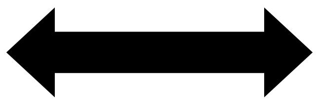

natural_image

Black double-headed arrow symbol pointing left and right (no text or labels)

<table><tr><td>5</td><td>3</td><td>4</td><td>6</td><td>7</td><td>8</td><td>9</td><td>1</td><td>2</td></tr><tr><td>6</td><td>7</td><td>2</td><td>1</td><td>9</td><td>5</td><td>3</td><td>4</td><td>8</td></tr><tr><td>1</td><td>9</td><td>8</td><td>3</td><td>4</td><td>2</td><td>5</td><td>6</td><td>7</td></tr><tr><td>8</td><td>5</td><td>9</td><td>7</td><td>6</td><td>1</td><td>4</td><td>2</td><td>3</td></tr><tr><td>4</td><td>2</td><td>6</td><td>8</td><td>5</td><td>3</td><td>7</td><td>9</td><td>1</td></tr><tr><td>7</td><td>1</td><td>3</td><td>9</td><td>2</td><td>4</td><td>8</td><td>5</td><td>6</td></tr><tr><td>9</td><td>6</td><td>1</td><td>5</td><td>3</td><td>7</td><td>2</td><td>8</td><td>4</td></tr><tr><td>2</td><td>8</td><td>7</td><td>4</td><td>1</td><td>9</td><td>6</td><td>3</td><td>5</td></tr><tr><td>3</td><td>4</td><td>5</td><td>2</td><td>8</td><td>6</td><td>1</td><td>7</td><td>9</td></tr></table>

Witness

natural_image

Illustration of a girl's face with pigtails and a small black arrow (no text or symbols)

P

This puzzle has a solution

# Zero-Knowledge Proof [GMR85]

text_image

5 3
6 7 2 1 9 5 3 4 8
1 9 8 3 4 2 5 6 7
8 5 9 7 6 1 4 2 3
4 2 6 8 5 3 7 9 1
7 1 3 9 2 4 8 5 6
9 6 1 5 3 7 2 8 4
2 8 7 4 1 9 6 3 5
3 4 5 2 8 6 1 7 9

# Completeness

V always accepts valid statements

# Zero-Knowledge Proof [GMR85]

text_image

5 3
6 7 2 1 9 5 3 4 8
1 9 8 3 4 2 5 6 7
8 5 9 7 6 1 4 2 3
4 2 6 8 5 3 7 9 1
7 1 3 9 2 4 8 5 6
9 6 1 5 3 7 2 8 4
2 8 7 4 1 9 6 3 5
3 4 5 2 8 6 1 7 9

# Completeness

V always accepts valid statements

# Soundness

If P does not have a witness, V rejects statements with high probability

# Zero-Knowledge Proof [GMR85]

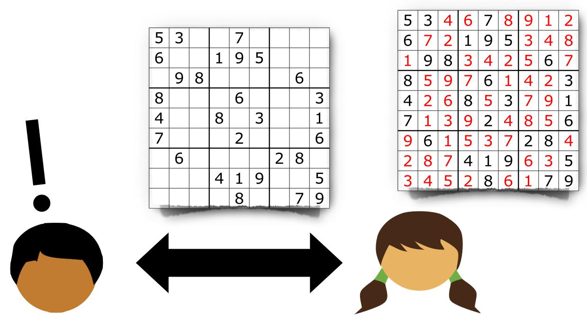

text_image

5 3
6 7 2 1 9 5 3 4 8
1 9 8 3 4 2 5 6 7
8 5 9 7 6 1 4 2 3
4 2 6 8 5 3 7 9 1
7 1 3 9 2 4 8 5 6
9 6 1 5 3 7 2 8 4
2 8 7 4 1 9 6 3 5
3 4 5 2 8 6 1 7 9

# Completeness

V always accepts valid statements

# Soundness

If P does not have a witness, V rejects statements with high probability

# Zero Knowledge

V learns nothing except that the statement is valid

# Generic Zero-Knowledge Proof

# Generic Zero-Knowledge Proof

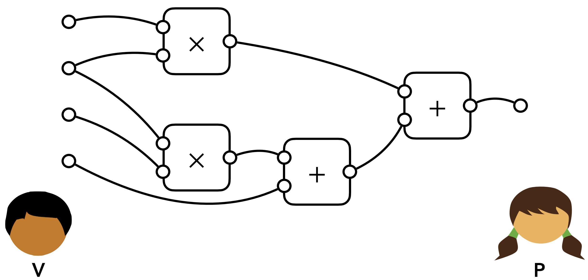

flowchart

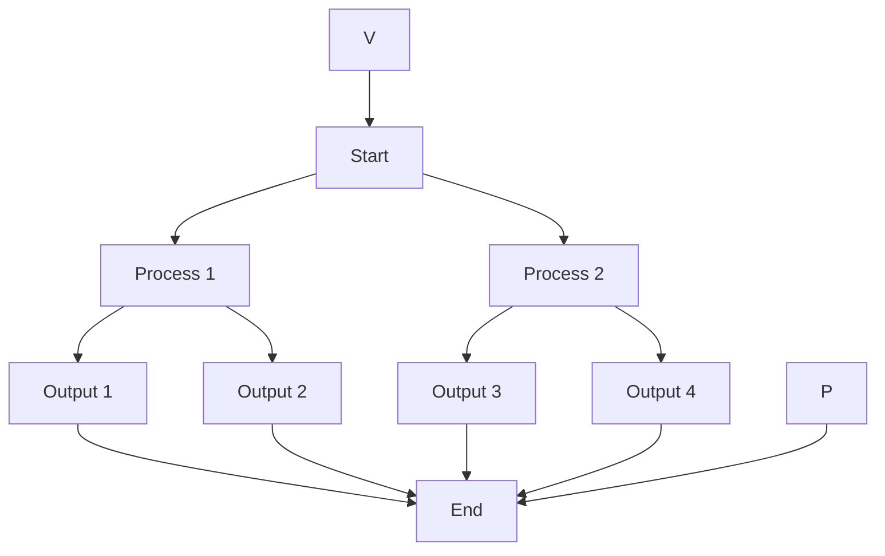
```mermaid
graph TD
    A["Start"] --> B["Process 1"]
    A --> C["Process 2"]
    B --> D["Output 1"]
    B --> E["Output 2"]
    C --> F["Output 3"]
    C --> G["Output 4"]
    D --> H["End"]
    E --> H
    F --> H
    G --> H
    I["V"] --> A
    J["P"] --> H
```

# Generic Zero-Knowledge Proof

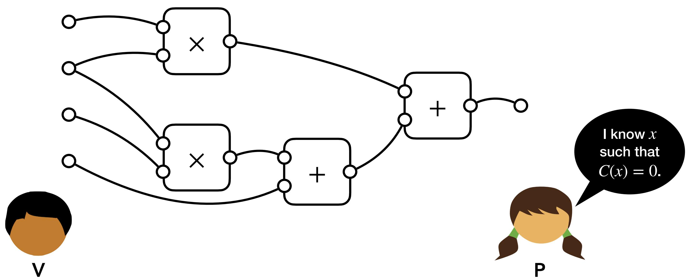

flowchart

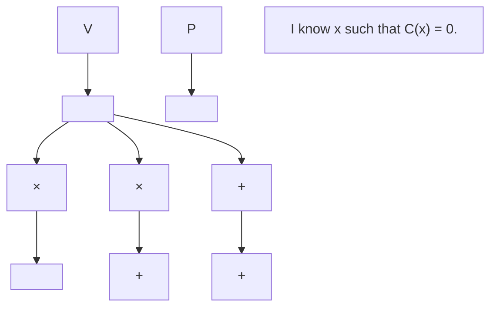
```mermaid
graph TD
    A[" "] --> B["×"]
    A --> C["×"]
    A --> D["+"]
    B --> E[" "]
    C --> F["+"]
    D --> G["+"]
    H["V"] --> A
    I["P"] --> J[" "]
    K["I know x such that C(x) = 0."]
```

# Problem: ZK RAM

# Problem: ZK RAM

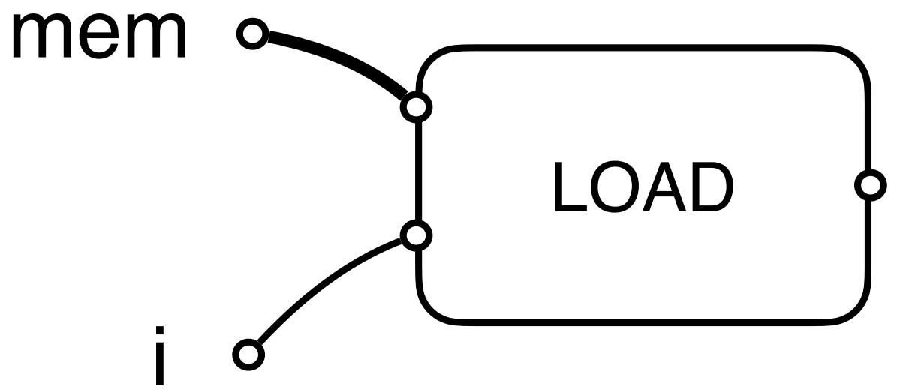

flowchart

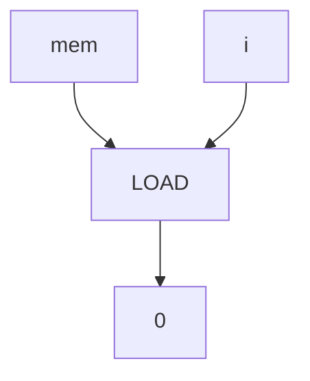
```mermaid
graph TD
    A["mem"] --> B["LOAD"]
    C["i"] --> B
    B --> D["0"]
```

# Problem: ZK RAM

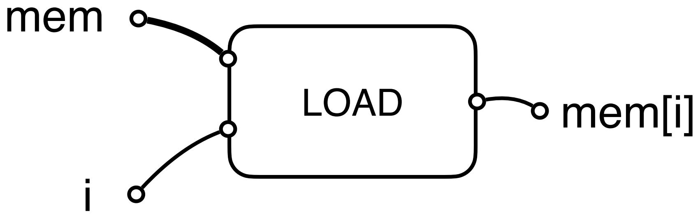

flowchart

```mermaid
graph TD
    A["mem"] --> B["LOAD"]
    C["i"] --> B
    B --> D["mem[i"]]
    style B fill:#f9f,stroke:#333
```

# Problem: ZK RAM

flowchart

```mermaid
graph TD
    A["mem"] --> B["LOAD"]
    C["i"] --> B
    B --> D["mem[i"]]
    style B fill:#f9f,stroke:#333
```

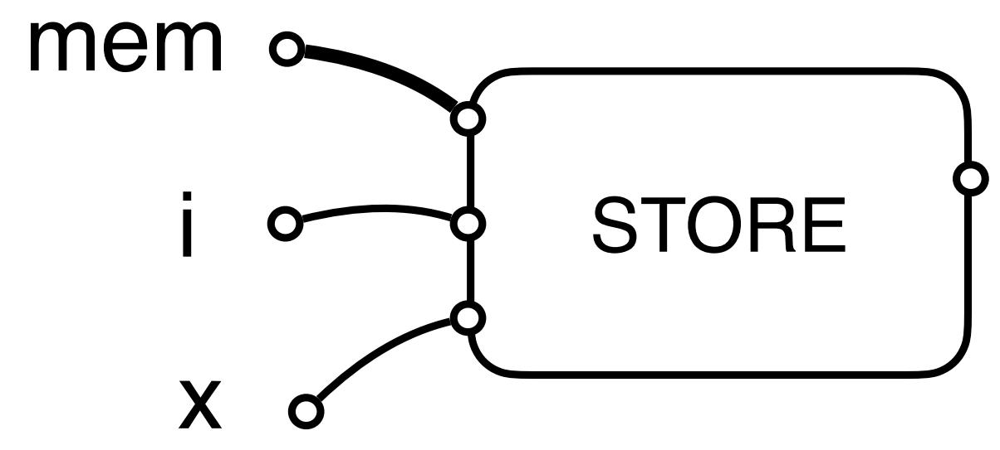

flowchart

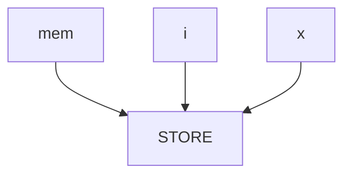
```mermaid
graph TD
    mem["mem"] --> STORE["STORE"]
    i["i"] --> STORE
    x["x"] --> STORE
```

# Problem: ZK RAM

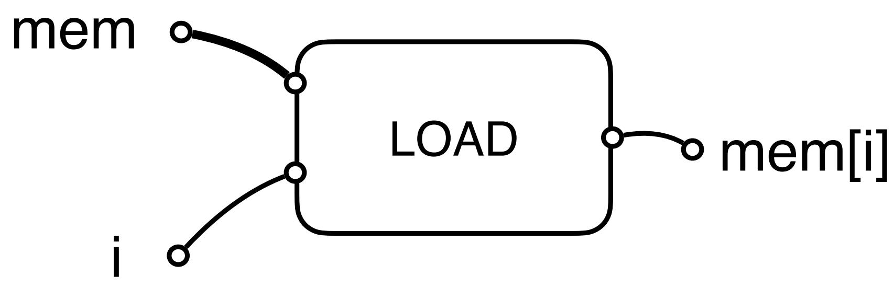

flowchart

```mermaid
graph TD
    A["mem"] --> B["LOAD"]
    C["i"] --> B
    B --> D["mem[i"]]
    style B fill:#f9f,stroke:#333
```

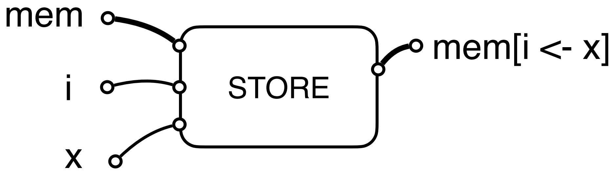

flowchart

```mermaid
graph TD
    A["mem"] --> B["STORE"]
    C["i"] --> B
    D["x"] --> B
    B --> E["mem[i <- x"]]
```

# Problem: ZK RAM

flowchart

```mermaid
graph TD
    A["mem"] --> B["LOAD"]
    C["i"] --> B
    B --> D["mem[i"]]
    style B fill:#f9f,stroke:#333
```

if r/w = 0: mem

else: mem[i <- x]

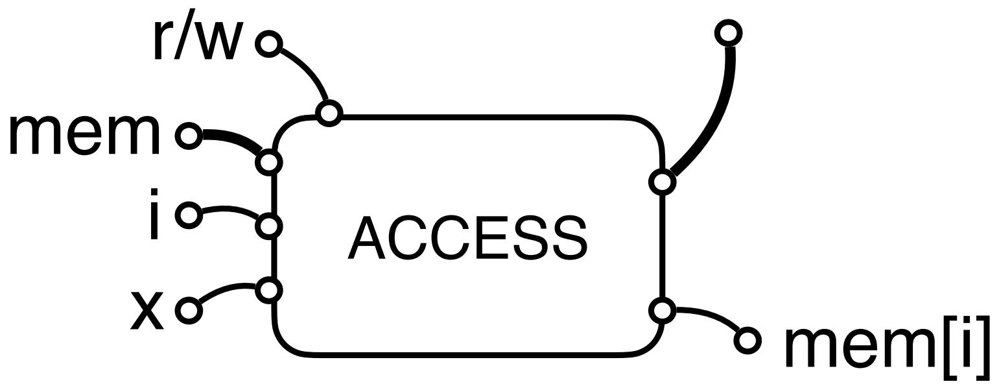

flowchart

```mermaid
graph TD
    A["ACCESS"] --> B["mem[i"]]
    A --> C["i"]
    A --> D["x"]
    A --> E["r/w"]
    A --> F["mem[i"]]
```

flowchart

```mermaid
graph TD
    A["mem"] --> B["STORE"]
    C["i"] --> B
    D["x"] --> B
    B --> E["mem[i <- x"]]
```

# Problem: ZK RAM

flowchart

```mermaid
graph TD
    A["mem"] --> B["LOAD"]
    C["i"] --> B
    B --> D["mem[i"]]
    style B fill:#f9f,stroke:#333
```

if r/w = 0: mem

else: mem[i <- x]

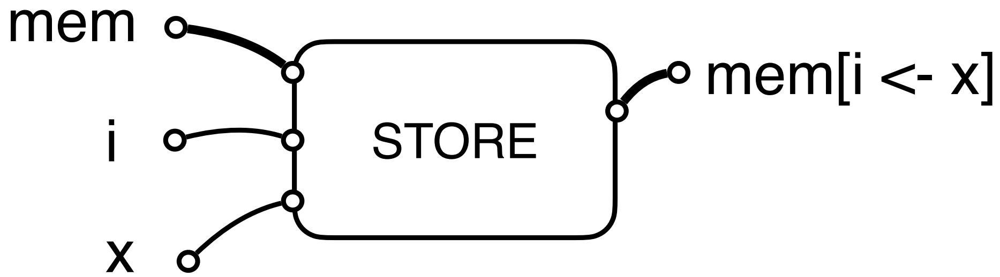

flowchart

```mermaid
graph TD
    A["mem"] --> B["STORE"]
    C["i"] --> B
    D["x"] --> B
    B --> E["mem[i <- x"]]
    style B fill:#f9f,stroke:#333
```

flowchart

```mermaid
graph TD
    A["ACCESS"] --> B["mem[i"]]
    A --> C["i"]
    A --> D["x"]
    A --> E["r/w"]
    A --> F["mem[i"]]
```

# Our ZK RAM in Recent Works

ZK CPU [YHHKV, CCS ’24]

ZK ML [HCLWZYZ, USENIX Security ’24]

# Terminology

# Terminology

flowchart

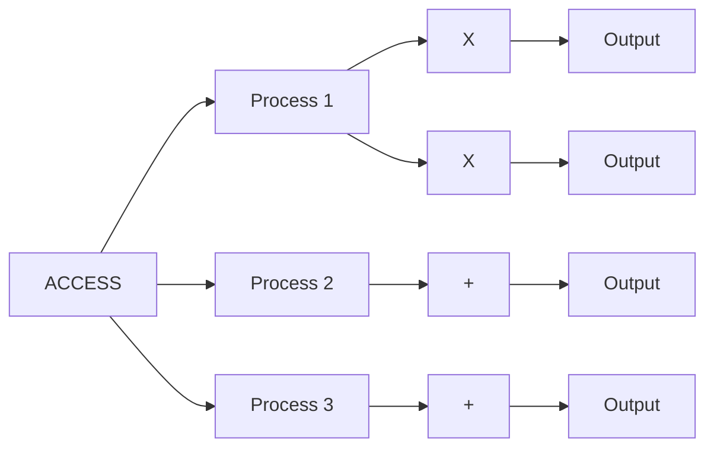
```mermaid
graph LR
    A["ACCESS"] --> B["Process 1"]
    A --> C["Process 2"]
    A --> D["Process 3"]
    B --> E["X"]
    B --> F["X"]
    C --> G["+"]
    D --> H["+"]
    E --> I["Output"]
    F --> J["Output"]
    G --> K["Output"]
    H --> L["Output"]
```

# Terminology

flowchart

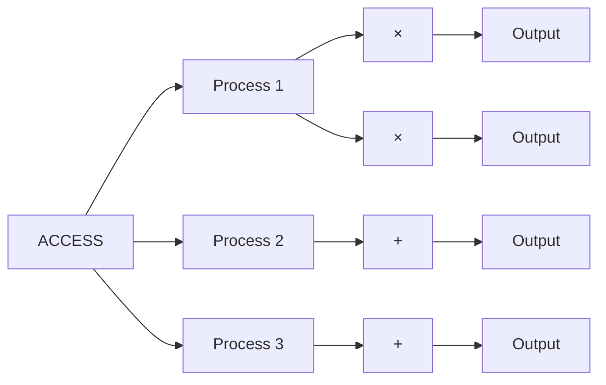
```mermaid
graph LR
    A["ACCESS"] --> B["Process 1"]
    A --> C["Process 2"]
    A --> D["Process 3"]
    B --> E["×"]
    B --> F["×"]
    C --> G["+"]
    D --> H["+"]
    E --> I["Output"]
    F --> J["Output"]
    G --> K["Output"]
    H --> L["Output"]
```

completeness soundness zero-knowledge

# Terminology

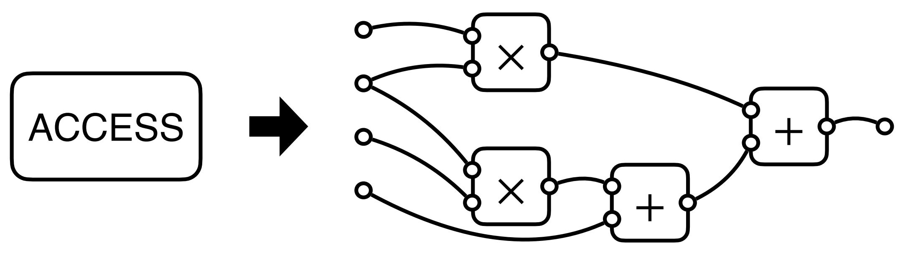

flowchart

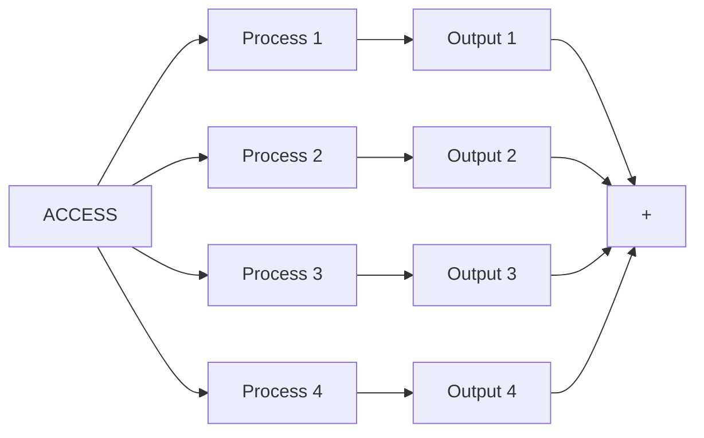
```mermaid
graph LR
    A["ACCESS"] --> B["Process 1"]
    A --> C["Process 2"]
    A --> D["Process 3"]
    A --> E["Process 4"]
    B --> F["Output 1"]
    C --> G["Output 2"]
    D --> H["Output 3"]
    E --> I["Output 4"]
    F --> J["+"]
    G --> J
    H --> J
    I --> J
```

completeness

soundness

zero-knowledge

Over some large fi eld

(i.e. $| \ F | = \lambda ^ { \omega ( 1 ) } )$

# Terminology

flowchart

```mermaid
graph LR
    A["ACCESS"] --> B["Process 1"]
    A --> C["Process 2"]
    A --> D["Process 3"]
    B --> E["×"]
    B --> F["×"]
    C --> G["+"]
    D --> H["+"]
    E --> I["Output"]
    F --> J["Output"]
    G --> K["Output"]
    H --> L["Output"]
```

completeness

soundness

zero-knowledge

Over some large fi eld

(i.e. $| \ F | = \lambda ^ { \omega ( 1 ) } )$

Nonlinear gates:

MUL, INPUT

Linear gates:

ADD, SCALE

# Terminology

flowchart

```mermaid
graph LR
    A["ACCESS"] --> B["Process 1"]
    A --> C["Process 2"]
    A --> D["Process 3"]
    B --> E["×"]
    B --> F["×"]
    C --> G["+"]
    D --> H["+"]
    E --> I["Output"]
    F --> J["Output"]
    G --> K["Output"]
    H --> L["Output"]
```

completeness

soundness

zero-knowledge

Over some large fi eld

(i.e. $| \ F | = \lambda ^ { \omega ( 1 ) } )$

Nonlinear gates:

MUL, INPUT

Linear gates:

ADD, SCALE

# Terminology

flowchart

```mermaid
graph LR
    A["ACCESS"] --> B["Process 1"]
    A --> C["Process 2"]
    A --> D["Process 3"]
    B --> E["×"]
    B --> F["×"]
    C --> G["+"]
    D --> H["+"]
    E --> I["Output"]
    F --> J["Output"]
    G --> K["Output"]
    H --> L["Output"]
```

completeness

soundness

zero-knowledge

Over some large fi eld

(i.e. $| \ F | = \lambda ^ { \omega ( 1 ) } )$

Nonlinear gates:

MUL, INPUT

Linear gates:

ADD, SCALE

\# memory slots: n

\# accesses: T

# Our Result

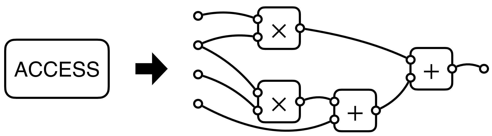

flowchart

```mermaid
graph LR
    A["ACCESS"] --> B["Process 1"]
    A --> C["Process 2"]
    A --> D["Process 3"]
    B --> E["X"]
    B --> F["X"]
    C --> G["+"]
    D --> H["+"]
    E --> I["Output"]
    F --> J["Output"]
    G --> K["Output"]
    H --> L["Output"]
```

# Our Result

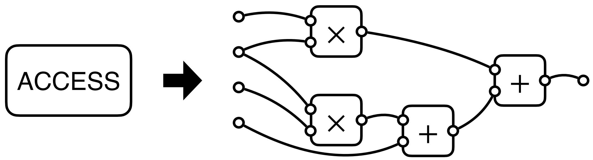

flowchart

```mermaid
graph LR
    A["ACCESS"] --> B["Process 1"]
    A --> C["Process 2"]
    A --> D["Process 3"]
    B --> E["X"]
    B --> F["X"]
    C --> G["+"]
    D --> H["+"]
    E --> I["Output"]
    F --> J["Output"]
    G --> K["Output"]
    H --> L["Output"]
```

Naïve linear scan: O(Tn)

# Our Result

flowchart

```mermaid
graph LR
    A["ACCESS"] --> B["Process 1"]
    A --> C["Process 2"]
    A --> D["Process 3"]
    B --> E["Output"]
    C --> E
    D --> E
    E --> F["Final Output"]
```

Naïve linear scan: O(Tn)

v.s.

Our construction: O(T + n)

# Our Result

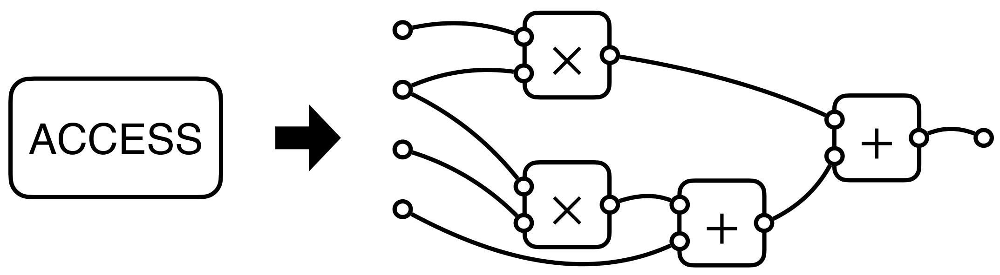

flowchart

```mermaid
graph LR
    A["ACCESS"] --> B["Process 1"]
    A --> C["Process 2"]
    A --> D["Process 3"]
    B --> E["Output"]
    C --> E
    D --> E
    E --> F["Final Output"]
```

Naïve linear scan: O(Tn)

v.s.

Our construction: O(T + n)

Hidden constant: 10

# Our Result

flowchart

```mermaid
graph LR
    A["ACCESS"] --> B["Process 1"]
    A --> C["Process 2"]
    A --> D["Process 3"]
    B --> E["X"]
    B --> F["X"]
    C --> G["+"]
    D --> H["+"]
    E --> I["Output"]
    F --> J["Output"]
    G --> K["Output"]
    H --> L["Output"]
```

Naïve linear scan: O(Tn)

v.s.

Our construction: O(T + n)

Hidden constant: 10

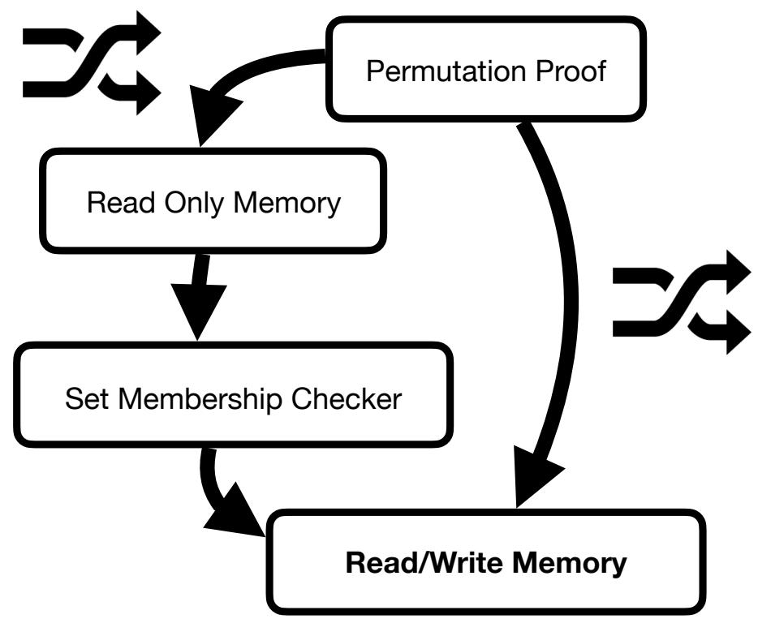

flowchart

```mermaid
graph TD
    A["Read Only Memory"] --> B["Set Membership Checker"]
    B --> C["Read/Write Memory"]
    C --> D["Permutation Proof"]
    D --> A
    B --> C
    C --> D
```

# Constant-Overhead Zero-Knowledge for RAM Programs

Nicholas Franzese\*Jonathan Katz†Steve Lut Rafail Ostrovsky§Xiao Wang\* Chenkai Weng\*

# Abstract

We show a constant-overhead interactive zero-knowledge (ZK) proof system for RAM programs,that is,a ZK proof in which the communication complexity as wellas the running times of the prover and verifier scale linearly in the size of the memory N and the running time T of the underlying RAM program. Besides yielding an asymptotic improvement of prior work, our implementation gives concrete performance improvements for RAM-based ZK proofs.In particular,our implementation supports ZK proofs of private read/write accesses to 64 MB ofmemory (2432-bitwords)usingonly34bytesofcommunicationperaccess,amorethan 80× improvement compared to the recent BubbleRAM protocol.We also design a lightweight RISC CPU that can efficiently emulate the MIPS-I instruction set,and for which our ZK proof communicates only \~ 320 bytes per cycle,more than 10× less than the BubbleRAM CPU.In a 100 Mbps network,we can perform zero-knowledge executions of our CPU (with 64 MB of main memory and 4 MB of program memory) at a clock rate of 6.6 KHz.

# 1Introduction

Zero-knowledge (ZK) proofs enable a prover P to convince a verifier V that the prover knows a witness w on which a particular program P evaluates to 1 without revealing anything additional about w.A series of works over the past several years (e.g.,[GGPR13,JKO13,BCC+16,Gro16, AHIV17,KKW18,BBB+18,XZZ+19,TS20,WYKW2i]) has shown several highly efficient ZK protocols,however for the most part these improved protocols have focused on the case where the program P is represented as a boolean or arithmetic circuit.This makes such proof systems somewhat difficult to apply to the arguably more natural setting where P is a program intended to be run on a general-purpose CPU,that is,when P is represented as a program in the random-access machine (RAM) model of computation.Although any such program can be converted to a circuit, doing so can be challenging and time consuming;more importantly,it can lead to sub-optimal performance as a general RAM program running in time Tand using memory of size N requires a circuit of size (TN) to verify its execution.

Some prior work has shown ZK proofs in the RAM model of computation.Hu,Mohasel, and Rosulek [HMR15],and subsequently Mohassel,Rosulek and Scafuro [MRS17],proposed an approach in which the addresses of memory accesses are revealed to the verifier; to account for that,they use oblivious RAM to make the original RAM program oblivious.Their focus was on asymptotic performance,and to the best of our knowledge their protocols have never been implemented. The TinyRAM framework [BCG+13,BCTV14,WSR+15] avoids the use of oblivious

\*Northwestern University, {nicholasfranzese2026@u,wangxiao@cs,ckweng@u}.northwestern.edu

tUniversity of Maryland,jkatz2@gmail.com

Stealth Software Technologies,Inc.,steve@stealthsoftwareinc.com

SUCLA, rafail@cs.ucla.edu

# Efficient Proof of RAM Programs from Any Public-Coin

# Zero-Knowledge System

Cyprien Delpech de Saint Guilhem Emmanuela Orsini Titouan Tanguy

Michiel Verbauwhede

imec-COSIC,KU Leuven, Belgium

firstname.lastname@kuleuven.be

# Abstract

We show a compiler that allows to prove the correct execution of RAM programs using any zero-knowledge system for circuit satisfiability.At the core of this work is an arithmetic circuit which verifies the consistency of a list of memory access tuples in zero-knowledge.

Using such a circuit,we obtain the first constant-round and concretely efcient zero-knowledge proof protocol for RAM programs using any stateless zero-knowledge proof system for Boolean or arithmetic circuits.Both the communication complexity and the prover and verifier run times asymptoticallyscale linearly in the size of thememoryand therun timeof the RAMprogram; we demonstrate concrete effciency with performance results of our C++ implementation.

Weconcretely instantiateourconstruction withaneficient MPC-in-the-Head proof system, Limbo (ACM CCS 2021).The C++ implementation of our access protocol extends that of Limbo and provides interactive proofs with 40 bits of statistical security with an amortized cost of 0.42ms of prover time and 2.8KB of communication per memory access,independently of the size of the memory; with multi-threading,this cost is reduced to 0.12ms and 1.8KB respectively. This performance of our public-coin protocol approaches that of priuate-coin protocol BubbleRAM (ACM CCS 2020,0.15ms and 1.5KB per access).

# 1 Introduction

A zero-knowledge (ZK) proof is a fundamental cryptographic tool which proves that a statement is true without revealing any other information. Since their introduction by Goldwasser,Micali and Rackof [GMR85],ZK proofs have had a significant impact on cryptography and have been the object of intense research work due to their theoretical importance and varied applicability.

Many types of ZK proof systems exist,each presenting different trade-offs between several efficiency measures.While in blockchain applications,the main focus is on succinct proofs of small statements [GGPR13,Grol6,Set20],another line of research has focused on prover efficiency [JKO13,AHIV17,KKW18,BCR+19,DIO21,dOT21],while other works have successfully constructed ZK proof systems for very large statements with good concrete eficiency [WYKW21, YSWW21,WYX+21, BR21].

Unfortunately,these works focus mostly on statements represented as circuits,either Boolean or arithmetic,which can incur a signifcant overhead to prove properties of large statements that are more naturally represented as random-access machine (RAM) programs.Many interesting functions and applications,such as private database search or verification of program execution,

# Constant-Overhead Zero-Knowledge for RAM Programs

Nicholas Franzese\*Jonathan Katz†Steve Lut Rafail Ostrovsky§Xiao Wang\* Chenkai Weng\*

# Abstract

We show a constant-overhead interactive zero-knowledge (ZK) proof system for RAM programs,that is,a ZK proof in which the communication complexity as wellas the running times of the prover and verifier scale linearly in the size of the memory N and the running time T of the underlying RAM program. Besides yielding an asymptotic improvement of prior work, our implementation gives concrete performance improvements for RAM-based ZK proofs.In particular,our implementation supports ZK proofs of private read/write accesses to 64 MB ofmemory (2432-bitwords)usingonly34bytesofcommunicationperaccess,amorethan 80× improvement compared to the recent BubbleRAM protocol.We also design a lightweight RISC CPU that can efficiently emulate the MIPS-I instruction set,and for which our ZK proof communicates only \~ 320 bytes per cycle,more than 10× less than the BubbleRAM CPU.In a 100 Mbps network,we can perform zero-knowledge executions of our CPU (with 64 MB of main memory and 4 MB of program memory) at a clock rate of 6.6 KHz.

# 1Introduction

Zero-knowledge (ZK) proofs enable a prover P to convince a verifier V that the prover knows a witness w on which a particular program P evaluates to 1 without revealing anything additional about w.A series of works over the past several years (e.g.,[GGPR13,JKO13,BCC+16,Gro16, AHIV17,KKW18,BBB+18,XZZ+19,TS20,WYKW2i]) has shown several highly efficient ZK protocols,however for the most part these improved protocols have focused on the case where the program P is represented as a boolean or arithmetic circuit.This makes such proof systems somewhat difficult to apply to the arguably more natural setting where P is a program intended to be run on a general-purpose CPU,that is,when P is represented as a program in the random-access machine (RAM) model of computation.Although any such program can be converted to a circuit, doing so can be challenging and time consuming;more importantly,it can lead to sub-optimal performance as a general RAM program running in time Tand using memory of size N requires a circuit of size O(TN) to verify its execution.

Some prior work has shown ZK proofs in the RAM model of computation.Hu,Mohasel, and Rosulek [HMR15],and subsequently Mohassel,Rosulek and Scafuro [MRS17],proposed an approach in which the addresses of memory accesses are revealed to the verifier; to account for that,they use oblivious RAM to make the original RAM program oblivious.Their focus was on asymptotic performance,and to the best of our knowledge their protocols have never been implemented. The TinyRAM framework [BCG+13,BCTV14,WSR+15] avoids the use of oblivious

\*Northwestern University, {nicholasfranzese2026@u,wangxiao@cs,ckweng@u}.northwestern.edu

tUniversity of Maryland,jkatz2@gmail.com

Stealth Software Technologies,Inc.,steve@stealthsoftwareinc.com

SUCLA, rafail@cs.ucla.edu

1

Up to ≈ 20 × improvement

# Efficient Proof of RAM Programs from Any Public-Coin Zero-Knowledge System

Cyprien Delpech de Saint Guilhem Emmanuela Orsini Titouan Tanguy Michiel Verbauwhede

imec-COSIC,KU Leuven,Belgium firstname.lastname@kuleuven.be

# Abstract

We show a compiler that allows to prove the correct execution of RAM programs using any zero-knowledge system for circuit satisfiability.At the core of this work is an arithmetic circuit which verifies the consistency of a list of memory access tuples in zero-knowledge.

Using such a circuit,we obtain the first constant-round and concretely efcient zero-knowledge proof protocol for RAM programs using any stateless zero-knowledge proof system for Boolean or arithmetic circuits.Both the communication complexity and the prover and verifier run times asymptoticallyscale linearly in the size of thememoryand therun timeof the RAMprogram; we demonstrate concrete efficiency with performance results of our C++ implementation.

Weconcretely instantiateourconstruction withaneficient MPC-in-the-Head proof system, Limbo (ACM CCS 2021).The C++ implementation of our access protocol extends that of Limbo and provides interactive proofs with 40 bits of statistical security with an amortized cost of 0.42ms of prover time and 2.8KB of communication per memory access,independently of the size of the memory; with multi-threading,this cost is reduced to 0.12ms and 1.8KB respectively. This performance of our public-coin protocol approaches that of priuate-coin protocol BubbleRAM (ACM CCS 2020,0.15ms and 1.5KB per access).

# 1 Introduction

A zero-knowledge (ZK)proof is a fundamental cryptographic tool which proves that a statement is true without revealing any other information.Since their introduction by Goldwasser,Micali and Rackof [GMR85],ZK proofs have had a significant impact on cryptography and have been the object of intense research work due to their theoretical importance and varied applicability.

Many types of ZK proof systems exist,each presenting different trade-offs between several efficiency measures.While in blockchain applications,the main focus is on succinct proofs of small statements [GGPR13,Grol6,Set20],another line of research has focused on prover efficiency [JKO13,AHIV17,KKW18,BCR+19,DIO21,dOT21],while other works have successfully constructed ZK proof systems for very large statements with good concrete eficiency [WYKW21, YSWW21,WYX+21, BR21].

Unfortunately,these works focus mostly on statements represented as circuits,either Boolean or arithmetic,which can incur a signifcant overhead to prove properties of large statements that are more naturally represented as random-access machine (RAM) programs.Many interesting functions and applications,such as private database search or verification of program execution,

1

≈ 3 × improvement

# Two Shuffles Make a RAM: Improved Constant Overhead Zero Knowledge RAM

Yibin Yang\* David Heatht

July 17,2023

# Abstract

We optimize Zero Knowledge (ZK) proofs of statements expressed as RAM programs over arithmetic values.Our arithmetic-circuit-based read/write memory uses only 4 input gates and 6 multiplication gates per memory access. This is an almost 3× total gate improvement over prior state of the art (Delpech de Saint Guilhem et al., SCN'22).

We implemented our memory in the context of ZK proofs based on vector oblivious linear evaluation (VOLE),and we further optimize based on techniques available in the VOLE setting. Our experiments show that (1)our total runtime improves over that of the prior best VOLE-ZK RAM (Franzese et al.,CCS'21) by up to 20x and (2) on a typical hardware setup,we can achieve \~ 600K RAM accesses per second.

We also develop improved read-only memory and set ZK data structures.These are used internally in our read/write memory and improve over prior work.

\*Georgia Institute of Technology,yyang8l1@gatech.edu. tUniversityofIllinois Urbana-Champaign,daheath@illinois.edu

# Today’s Focus

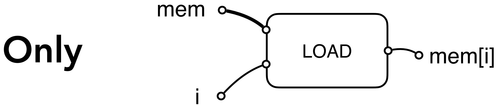

flowchart

```mermaid
graph TD
    A["i"] --> B["LOAD"]
    B --> C["mem[i"]]
    style B fill:#f9f,stroke:#333,stroke-width:2px
```

“One shuffl e makes a ROM”

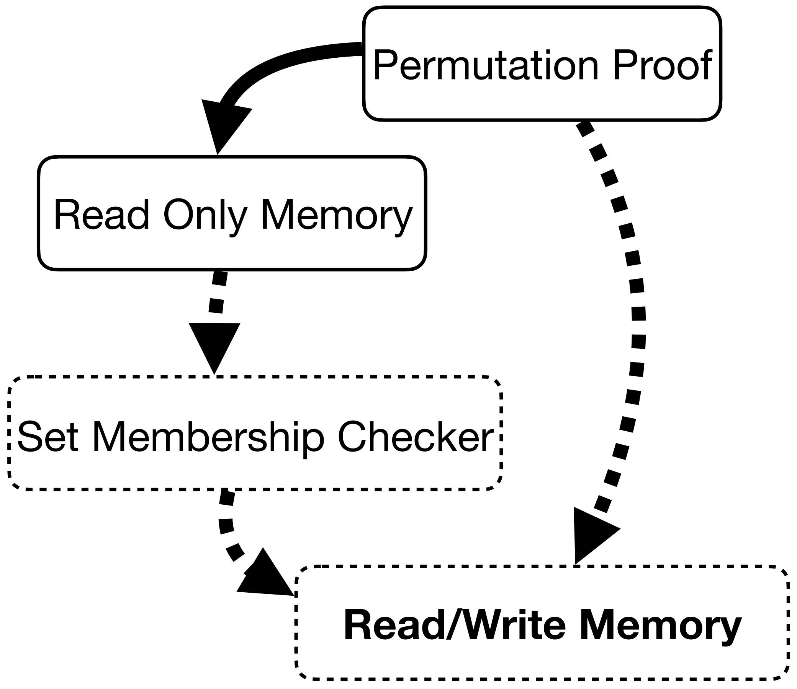

flowchart

```mermaid
graph TD
    A["Permutation Proof"] --> B["Read Only Memory"]
    B --> C["Set Membership Checker"]
    C --> D["Read/Write Memory"]
    D --> A
```

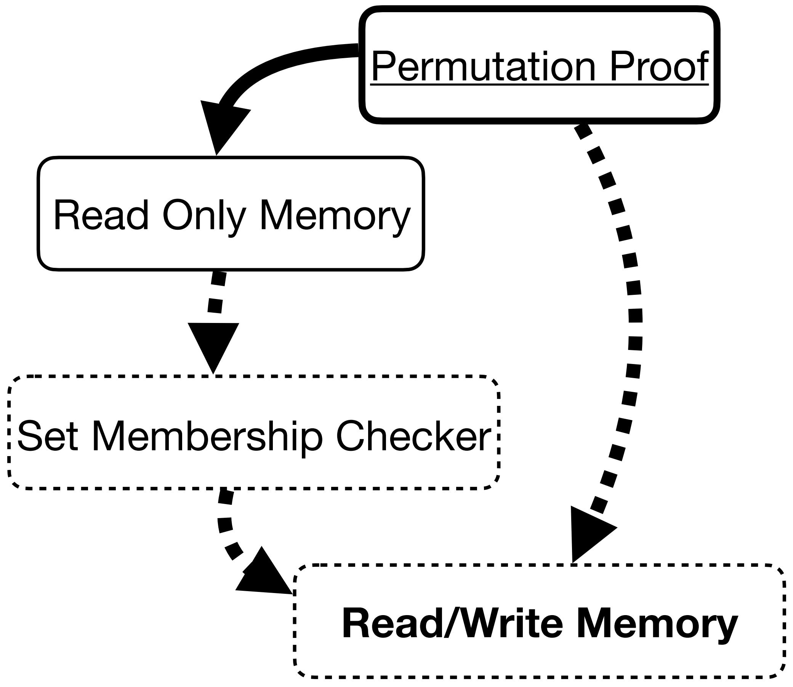

flowchart

```mermaid
graph TD
    A["Permutation Proof"] --> B["Read Only Memory"]
    B --> C["Set Membership Checker"]
    C --> D["Read/Write Memory"]
    D --> A
```

# Preliminaries: Proof of a Permutation

Consider vectors of elements $\overrightarrow { x } , \overrightarrow { y }$

Are $\overrightarrow { x }$ and $\overrightarrow { y }$ related by a permutation? ⃗

$$
\vec {x} \sim \vec {y}
$$

# Preliminaries: Proof of a Permutation

# Consider vectors of elements $\overrightarrow { x } , \overrightarrow { y }$

Are $\overrightarrow { x }$ and $\overrightarrow { y }$ related by a permutation? ⃗

$$
\vec {x} \sim \vec {y}
$$

$$
p (X) = \prod_ {i} (X - x _ {i}) \qquad \overrightarrow {x} \sim \overrightarrow {y} \iff p = q
$$

$$
q (X) = \prod_ {i} (X - y _ {i})
$$

# Preliminaries: Proof of a Permutation

# Consider vectors of elements $\overrightarrow { x } , \overrightarrow { y }$

# Are $\overrightarrow { x }$ and $\overrightarrow { y }$ related by a permutation? ⃗

$$
\vec {x} \sim \vec {y}
$$

$$
p (X) = \prod_ {i} (X - x _ {i})
$$

$$
q (X) = \prod_ {i} (X - y _ {i})
$$

$$
\vec {x} \sim \vec {y} \iff p = q
$$

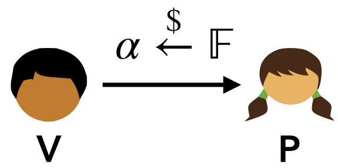

flowchart

```mermaid
graph LR
    V["Node V"] -->|α ← $, F| P["Node P"]
```

Proof: $p ( \alpha ) = q ( \alpha )$

Based on the

SZDL Lemma

[DL78,Sch80,Zip89]

# Preliminaries: Proof of a Permutation

# Proving $\overrightarrow { x } \sim \overrightarrow { y }$ uses only ⃗ $2 n - 2 \mathsf { M } \mathsf { U }$ gates

$$
p (X) = \prod_ {i} (X - x _ {i})
$$

$$
q (X) = \prod_ {i} (X - y _ {i})
$$

$$
\vec {x} \sim \vec {y} \iff p = q
$$

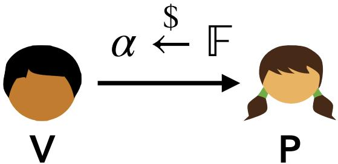

flowchart

```mermaid
graph LR
    V["Node V"] -->|α ← $ | F["Node F"]
    F --> P["Node P"]
```

Proof: $p ( \alpha ) = q ( \alpha )$

Based on the

SZDL Lemma

[DL78,Sch80,Zip89]

# Preliminaries: Proof of a Permutation

# Proving $\overrightarrow { x } \sim \overrightarrow { y }$ uses only ⃗ 2n − 2 MUL gates

# Generalizes to vectors of tuples [DdSGOTV22]

$$
p (X) = \prod_ {i} (X - \vec {x} _ {i})
$$

$$
q (X) = \prod_ {i} (X - \vec {y} _ {i})
$$

$$
\overrightarrow {x} \sim \overrightarrow {y} \iff p = q
$$

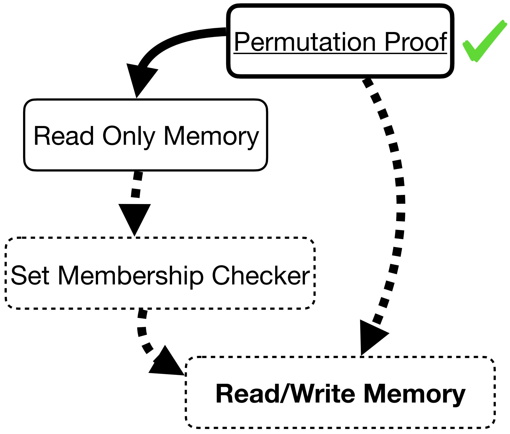

flowchart

```mermaid
graph TD
    A["Read Only Memory"] --> B["Set Membership Checker"]
    B --> C["Read/Write Memory"]
    C --> D["Permutation Proof"]
    D --> E["✓"]
    B -.-> C
```

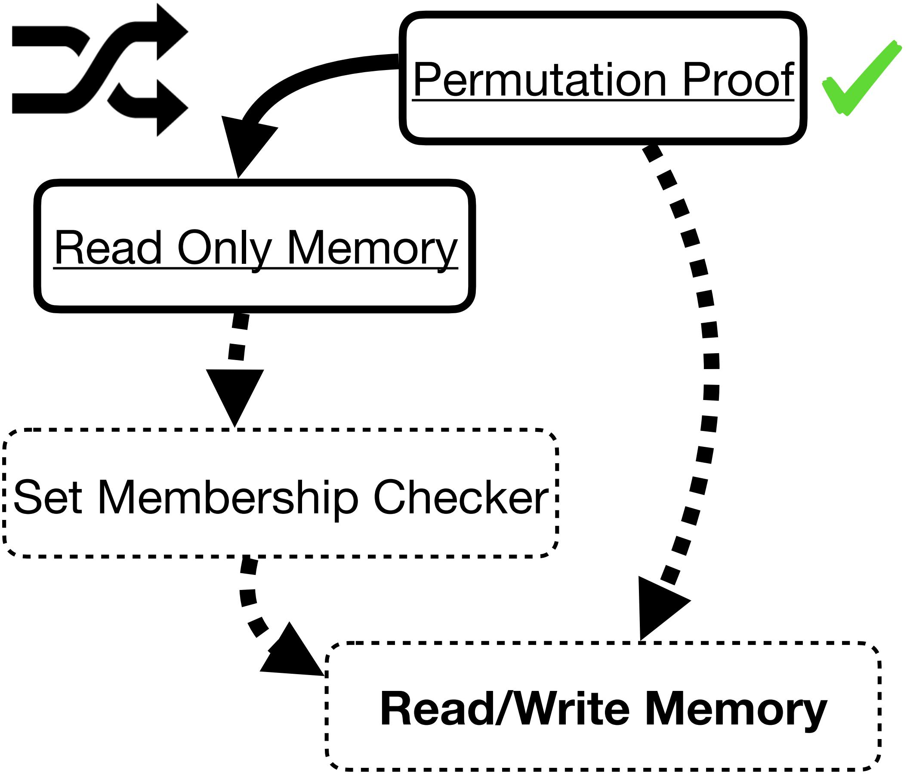

flowchart

```mermaid
graph TD
    A["Read Only Memory"] --> B["Set Membership Checker"]
    B --> C["Read/Write Memory"]
    C --> D["Permutation Proof"]
    D --> E["✓"]
    A -.-> C
```

# Read-Only Memory

<table><tr><td>Key</td><td>Value</td></tr><tr><td>0</td><td>x[0]</td></tr><tr><td>1</td><td>x[1]</td></tr><tr><td>2</td><td>x[2]</td></tr></table>

LOAD(i)

# Read-Only Memory

LOAD(i)

<table><tr><td>Key</td><td>Value</td></tr><tr><td>0</td><td>x[0]</td></tr><tr><td>1</td><td>x[1]</td></tr><tr><td>2</td><td>x[2]</td></tr></table>

# Key insight:

We just need to check P does not cheat

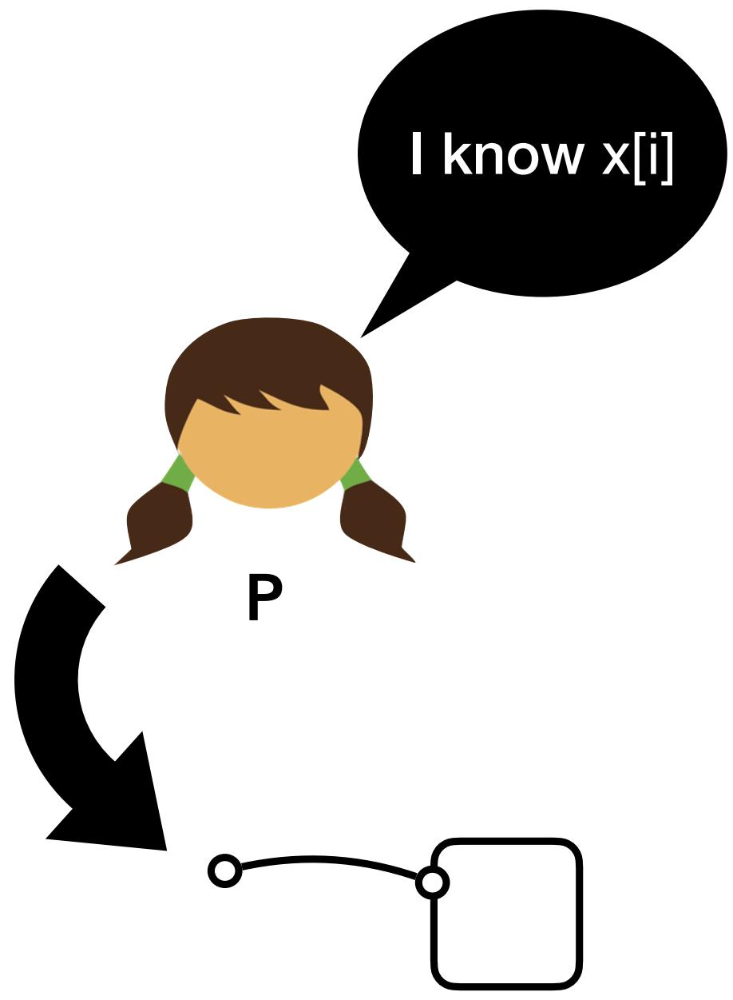

text_image

I know x[i]
P

# Read-Only Memory

LOAD(i)

<table><tr><td>Key</td><td>Value</td></tr><tr><td>0</td><td>x[0]</td></tr><tr><td>1</td><td>x[1]</td></tr><tr><td>2</td><td>x[2]</td></tr></table>

# Key insight:

We just need to check P does not cheat

# How?

Construct the “one-time” readable entries, and create a “reading history log”

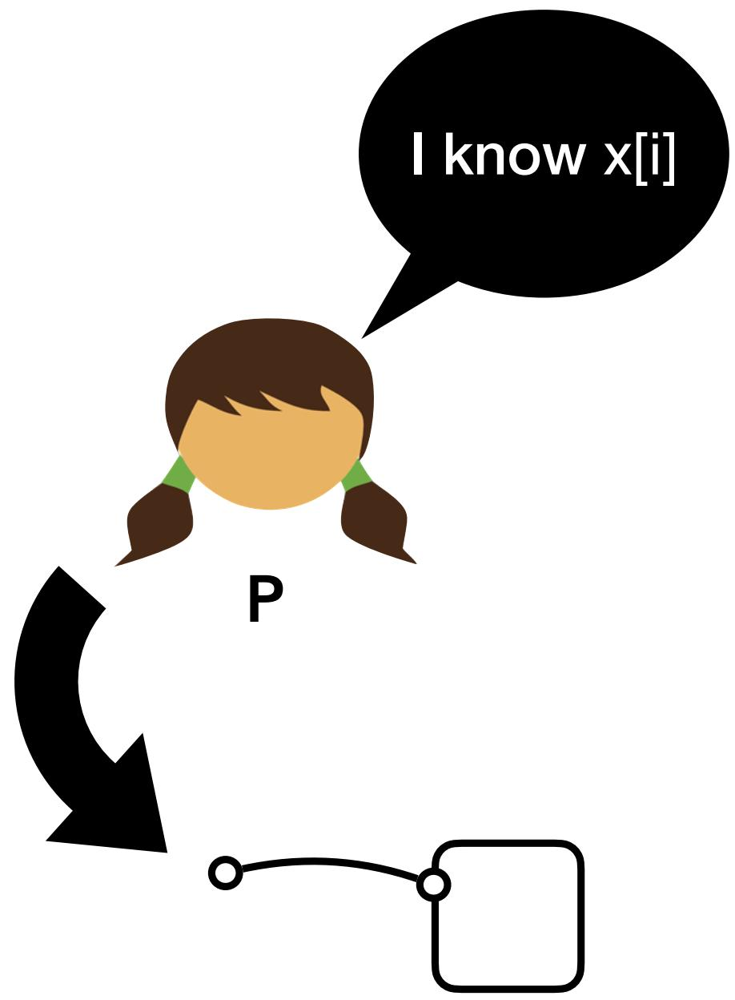

text_image

I know x[i]
P

# Read-Only Memory

Make vectors of triples: (index, value, version)

<table><tr><td>Key</td><td>Value</td></tr><tr><td>0</td><td>x[0]</td></tr><tr><td>1</td><td>x[1]</td></tr><tr><td>2</td><td>x[2]</td></tr></table>

writes

reads

natural_image

Simple illustration of a girl with pigtails and green tassels, labeled 'P' below (no text or symbols on the girl itself)

SETUP

# Read-Only Memory

Make vectors of triples: (index, value, version)

<table><tr><td>Key</td><td>Value</td></tr><tr><td>0</td><td>x[0]</td></tr><tr><td>1</td><td>x[1]</td></tr><tr><td>2</td><td>x[2]</td></tr></table>

writes

0,x[0],0

1,x[1],0

2,x[2],0

reads

natural_image

Simple illustration of a girl with pigtails and green tassels, labeled 'P' below (no text or symbols on the girl itself)

SETUP

# Read-Only Memory

Make vectors of triples: (index, value, version)

<table><tr><td>Key</td><td>Value</td></tr><tr><td>0</td><td>x[0]</td></tr><tr><td>1</td><td>x[1]</td></tr><tr><td>2</td><td>x[2]</td></tr></table>

# writes

0,x[0],0

1,x[1],0

2,x[2],0

# reads

natural_image

Simple illustration of a girl with pigtails and green tassels, labeled 'P' below (no text or symbols on the girl itself)

LOAD(1)

# Read-Only Memory

Make vectors of triples: (index, value, version)

<table><tr><td>Key</td><td>Value</td></tr><tr><td>0</td><td>x[0]</td></tr><tr><td>1</td><td>x[1]</td></tr><tr><td>2</td><td>x[2]</td></tr></table>

# writes

0,x[0],0

1,x[1],0

2,x[2],0

# reads

value: y0 version: v0

natural_image

Simple cartoon illustration of a girl with pigtails and green tassels, labeled 'P' below (no text or symbols on the girl itself)

LOAD(1)

# Read-Only Memory

Make vectors of triples: (index, value, version)

<table><tr><td>Key</td><td>Value</td></tr><tr><td>0</td><td>x[0]</td></tr><tr><td>1</td><td>x[1]</td></tr><tr><td>2</td><td>x[2]</td></tr></table>

# writes

0,x[0],0

1,x[1],0

2,x[2],0

1,y0,v0+1

# reads

1,y0,v0

value: y0 version: v0

natural_image

Simple cartoon illustration of a girl with pigtails and green tassels, labeled 'P' below (no text or symbols on the girl itself)

LOAD(1)

# Read-Only Memory

Make vectors of triples: (index, value, version)

<table><tr><td>Key</td><td>Value</td></tr><tr><td>0</td><td>x[0]</td></tr><tr><td>1</td><td>x[1]</td></tr><tr><td>2</td><td>x[2]</td></tr></table>

# writes

0,x[0],0

1,x[1],0

2,x[2],0

1,y0,v0+1

0,y1,v1+1

# reads

1,y0,v0

0,y1,v1

value: y1 version: v1

natural_image

Simple cartoon illustration of a girl with pigtails and green tassels, labeled 'P' below (no text or symbols on the girl itself)

LOAD(0)

# Read-Only Memory

Make vectors of triples: (index, value, version)

<table><tr><td>Key</td><td>Value</td></tr><tr><td>0</td><td>x[0]</td></tr><tr><td>1</td><td>x[1]</td></tr><tr><td>2</td><td>x[2]</td></tr></table>

# writes

0,x[0],0

1,x[1],0

2,x[2],0

1,y0,v0+1

0,y1,v1+1

1,y2,v2+1

# reads

1,y0,v0

0,y1,v1

1,y2,v2

value: y2 version: v2

natural_image

Simple cartoon illustration of a girl with pigtails and green tassels, labeled 'P' below (no text or symbols on the girl itself)

LOAD(1)

# Read-Only Memory

Make vectors of triples: (index, value, version)

<table><tr><td>Key</td><td>Value</td></tr><tr><td>0</td><td>x[0]</td></tr><tr><td>1</td><td>x[1]</td></tr><tr><td>2</td><td>x[2]</td></tr></table>

# writes

$0 , \times [ 0 ] , 0$

$1 , \mathsf { x } [ 1 ] , 0$

$2 , \mathsf { x } [ 2 ] , 0$

1,y0,v0+1

0,y1,v1+1

$1 , y 2 , v 2 + 1$

# reads

$1 , \mathsf { y 0 } , \mathsf { v 0 }$

$0 , \mathsf { y } \mathsf { 1 } , \mathsf { v } \mathsf { 1 }$

$1 , \mathsf { y } 2 , \mathsf { v } 2$

natural_image

Simple illustration of a girl with pigtails and green tassels, labeled 'P' below (no text or symbols on the girl itself)

TEARDOWN

# Read-Only Memory

Make vectors of triples: (index, value, version)

<table><tr><td>Key</td><td>Value</td></tr><tr><td>0</td><td>x[0]</td></tr><tr><td>1</td><td>x[1]</td></tr><tr><td>2</td><td>x[2]</td></tr></table>

# writes

$0 , \times [ 0 ] , 0$

$1 , \mathsf { x } [ 1 ] , 0$

$2 , \mathsf { x } [ 2 ] , 0$

$1 , \mathsf { y 0 } , \mathsf { v 0 } + 1$

$0 , \mathsf { y } 1 , \mathsf { v } 1 + 1$

$1 , y 2 , v 2 + 1$

# reads

$1 , \mathsf { y 0 } , \mathsf { v 0 }$

0,y1,v1

1,y2,v2

$0 , \mathsf { x } [ 0 ] , \mathsf { v } 3$

text_image

version: v3
P

TEARDOWN

# Read-Only Memory

Make vectors of triples: (index, value, version)

<table><tr><td>Key</td><td>Value</td></tr><tr><td>0</td><td>x[0]</td></tr><tr><td>1</td><td>x[1]</td></tr><tr><td>2</td><td>x[2]</td></tr></table>

# writes

$0 , \times [ 0 ] , 0$

$1 , \mathsf { x } [ 1 ] , 0$

2,x[2],0

1,y0,v0+1

$0 , \mathsf { y } 1 , \mathsf { v } 1 + 1$

1,y2,v2+1

# reads

$1 , \mathsf { y 0 } , \mathsf { v 0 }$

0,y1,v1

1,y2,v2

$0 , \mathsf { x } [ 0 ] , \mathsf { v } 3$

$1 , \times [ 1 ] , \lor 4$

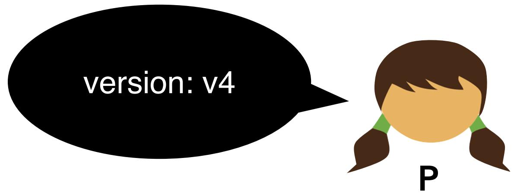

text_image

version: v4
P

TEARDOWN

# Read-Only Memory

Make vectors of triples: (index, value, version)

<table><tr><td>Key</td><td>Value</td></tr><tr><td>0</td><td>x[0]</td></tr><tr><td>1</td><td>x[1]</td></tr><tr><td>2</td><td>x[2]</td></tr></table>

# writes

0,x[0],0

1,x[1],0

2,x[2],0

1,y0,v0+1

0,y1,v1+1

1,y2,v2+1

# reads

1,y0,v0

0,y1,v1

1,y2,v2

0,x[0],v3

1,x[1],v4

2,x[2],v5

text_image

version: v5
P

TEARDOWN

# Read-Only Memory

Make vectors of triples: (index, value, version)

<table><tr><td>Key</td><td>Value</td></tr><tr><td>0</td><td>x[0]</td></tr><tr><td>1</td><td>x[1]</td></tr><tr><td>2</td><td>x[2]</td></tr></table>

# writes

0,x[0],0

1,x[1],0

2,x[2],0

1,y0,v0+1

0,y1,v1+1

1,y2,v2+1

# reads

1,y0,v0

0,y1,v1

1,y2,v2

0,x[0],v3

1,x[1],v4

2,x[2],v5

Use 2n+2T-2 MUL gates to check reads \~ writes

Claim: if reads \~ writes, P did not cheat

# Read-Only Memory

Make vectors of triples: (index, value, version)

<table><tr><td>Key</td><td>Value</td></tr><tr><td>0</td><td>x[0]</td></tr><tr><td>1</td><td>x[1]</td></tr><tr><td>2</td><td>x[2]</td></tr></table>

writes

0,x[0],0

1,x[1],0

2,x[2],0

1,y0,v0+1

0,y1,v1+1

1,y2,v2+1

reads

1,y0,v0

0,y1,v1

1,y2,v2

0,x[0],v3

1,x[1],v4

2,x[2],v5

Use 2n+2T-2 MUL gates to check reads \~ writes

Claim: if reads \~ writes, P did not cheat

# Read-Only Memory

Make vectors of triples: (index, value, version)

<table><tr><td>Key</td><td>Value</td></tr><tr><td>0</td><td>x[0]</td></tr><tr><td>1</td><td>x[1]</td></tr><tr><td>2</td><td>x[2]</td></tr></table>

# writes

0,x[0],0

1,x[1],0

2,x[2],0

1,y0,v0+1

0,y1,v1+1

1,y2,v2+1

# reads

1,y0,v0

0,y1,v1

1,y2,v2

0,x[0],v3

1,x[1],v4

2,x[2],v5

Use 2n+2T-2 MUL gates to check reads \~ writes

Claim: if reads \~ writes, P did not cheat

# Read-Only Memory

Make vectors of triples: (index, value, version)

<table><tr><td>Key</td><td>Value</td></tr><tr><td>0</td><td>x[0]</td></tr><tr><td>1</td><td>x[1]</td></tr><tr><td>2</td><td>x[2]</td></tr></table>

# writes

0,x[0],0

1,x[1],0

2,x[2],0

1,y0,v0+1

0,y1,v1+1

1,y2,v2+1

# reads

1,y0,v0

0,y1,v1

1,y2,v2

0,x[0],v3

1,x[1],v4

2,x[2],v5

Use 2n+2T-2 MUL gates to check reads \~ writes

Claim: if reads \~ writes, P did not cheat

# Read-Only Memory

Make vectors of triples: (index, value, version)

<table><tr><td>Key</td><td>Value</td></tr><tr><td>0</td><td>x[0]</td></tr><tr><td>1</td><td>x[1]</td></tr><tr><td>2</td><td>x[2]</td></tr></table>

# writes

0,x[0],0

1,x[1],0

2,x[2],0

1,x[1],v0+1

0,y1,v1+1

1,x[1],v2+1

# reads

1,x[1],v0

0,y1,v1

1,x[1],v2

0,x[0],v3

1,x[1],v4

2,x[2],v5

Use 2n+2T-2 MUL gates to check reads \~ writes

Claim: if reads \~ writes, P did not cheat

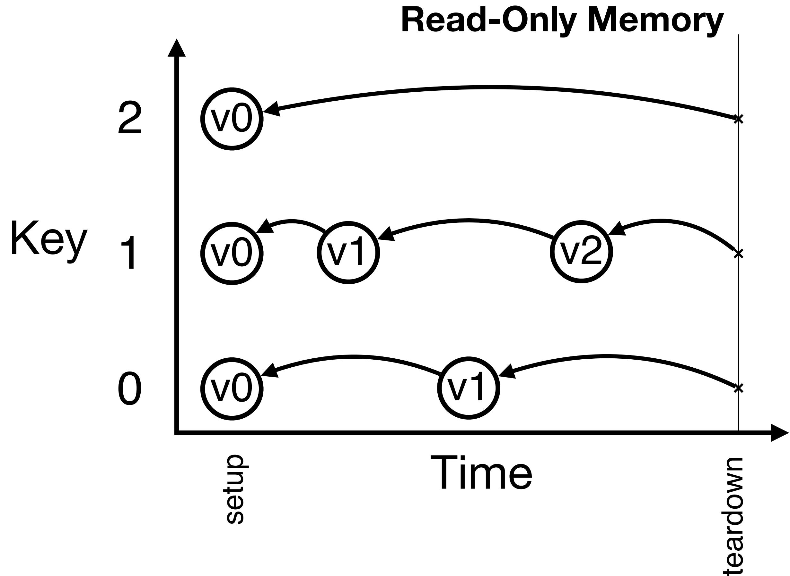

line

| Key | Time Point | Value |
| --- | --- | --- |
| v0 | setup | 2 |
| v0 | v1 | 1 |
| v0 | teardown | 0 |
| v1 | setup | 1 |
| v1 | v1 | 0 |
| v2 | teardown | 1 |

# Read-Only Memory

Make vectors of triples: (index, value, version)

<table><tr><td>Key</td><td>Value</td></tr><tr><td>0</td><td>x[0]</td></tr><tr><td>1</td><td>x[1]</td></tr><tr><td>2</td><td>x[2]</td></tr></table>

# writes

0,x[0],0

1,x[1],0

2,x[2],0

1,y0,v0+1

0,y1,v1+1

1,y2,v2+1

# reads

1,y0,v0

0,y1,v1

1,y2,v2

0,x[0],v3

1,x[1],v4

2,x[2],v5

Use 2n+2T-2 MUL gates to check reads \~ writes

Claim: if reads \~ writes, P did not cheat

# Read-Only Memory

Make vectors of triples: (index, value, version)

<table><tr><td>Key</td><td>Value</td></tr><tr><td>0</td><td>x[0]</td></tr><tr><td>1</td><td>x[1]</td></tr><tr><td>2</td><td>x[2]</td></tr></table>

# writes

0,x[0],0

1,x[1],0

2,x[2],0

1,y0,v0+1

0,y1,v1+1

1,y2,v2+1

# reads

1,y0,v0

0,y1,v1

1,y2,v2

0,x[0],v3

1,x[1],v4

2,x[2],v5

Use 2n+2T-2 MUL gates to check reads \~ writes

Claim: if reads \~ writes, P did not cheat

# Read-Only Memory

Make vectors of triples: (index, value, version)

<table><tr><td>Key</td><td>Value</td></tr><tr><td>0</td><td>x[0]</td></tr><tr><td>1</td><td>x[1]</td></tr><tr><td>2</td><td>x[2]</td></tr></table>

# writes

0,x[0],0

1,x[1],0

2,x[2],0

1,x[1],v0+1

0,y1,v1+1

1,x[1],v2+1

# reads

1,x[1],v0

0,y1,v1

1,x[1],v2

0,x[0],v3

1,x[1],v4

2,x[2],v5

Use 2n+2T-2 MUL gates to check reads \~ writes

Claim: if reads \~ writes, P did not cheat

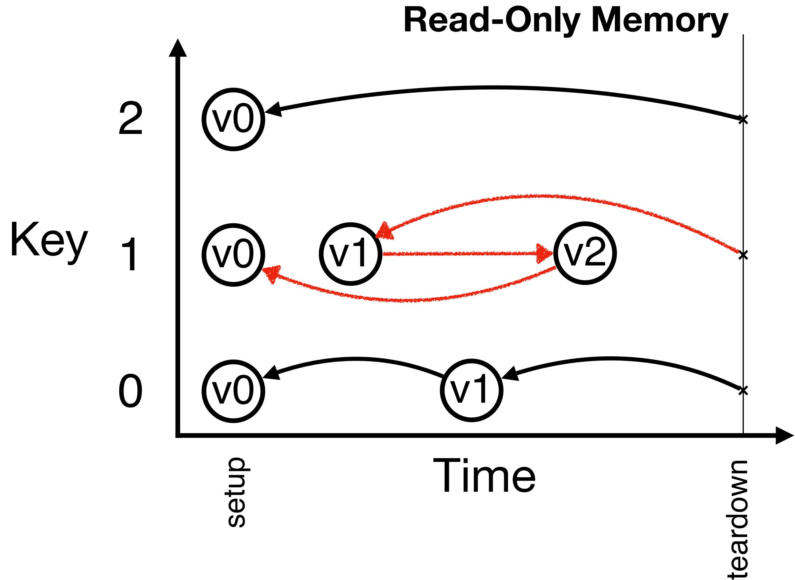

line

| Time     | Key  |
| -------- | ---- |
| setup    | v0   |
| setup    | v1   |
| setup    | v2   |
| teardown | 0    |
| teardown | 1    |
| teardown | 2    |

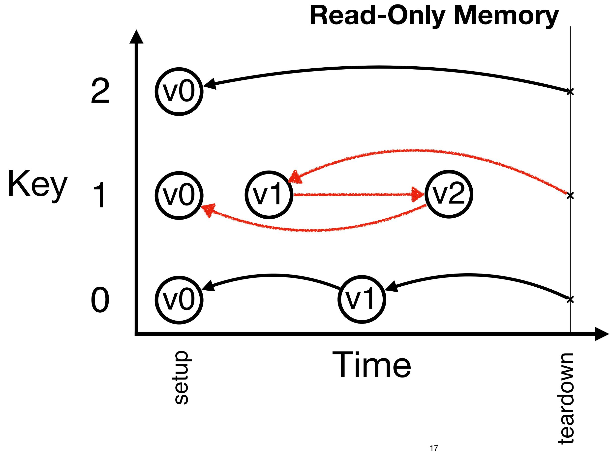

line

| Time     | Key  |
| -------- | ---- |
| setup    | v0   |
| setup    | v1   |
| setup    | v2   |
| teardown | 2    |
| teardown | 1    |
| teardown | 0    |

Diff erence between ROM and RAM:

RAM must prevent P from reading from the future

line

| Time     | Key  |
| -------- | ---- |
| setup    | v0   |
| setup    | v1   |
| setup    | v2   |
| teardown | 2    |
| teardown | 1    |
| teardown | 0    |

Diff erence between ROM and RAM:

RAM must prevent P from reading from the future

How?

line

| Time     | Key  |
| -------- | ---- |
| setup    | v0   |
| setup    | v1   |
| setup    | v2   |
| teardown | 2    |
| teardown | 1    |
| teardown | 0    |

Di ff erence between ROM and RAM:

RAM must prevent P from reading from the future

# How?

Instead of “version”, consider “timestamp”. Then, prove the “time di ff erence” is positive.

line

| Time     | Key  |
| -------- | ---- |
| setup    | v0   |
| setup    | v1   |
| setup    | v2   |
| teardown | 2    |
| teardown | 1    |
| teardown | 0    |

Di ff erence between ROM and RAM:

RAM must prevent P from reading from the future

# How?

Instead of “version”, consider “timestamp”. Then, prove the “time di ff erence” is positive.

How?

line

| Time     | Key  |
| -------- | ---- |
| setup    | v0   |
| setup    | v1   |
| setup    | v2   |
| teardown | 2    |
| teardown | 1    |
| teardown | 0    |

Di ff erence between ROM and RAM:

RAM must prevent P from reading from the future

# How?

Instead of “version”, consider “timestamp”. Then, prove the “time di ff erence” is positive.

# How?

Hint: A ZK ROM with1,2,…,T indexes

# Read-Only Memory

<table><tr><td>Key</td><td>Value</td></tr><tr><td>0</td><td>x[0]</td></tr><tr><td>1</td><td>x[1]</td></tr><tr><td>2</td><td>x[2]</td></tr></table>

On an access, P gives two inputs: value and version

2 INPUTs, 2 MULs per access

After T accesses, permutation check on length n+T vectors

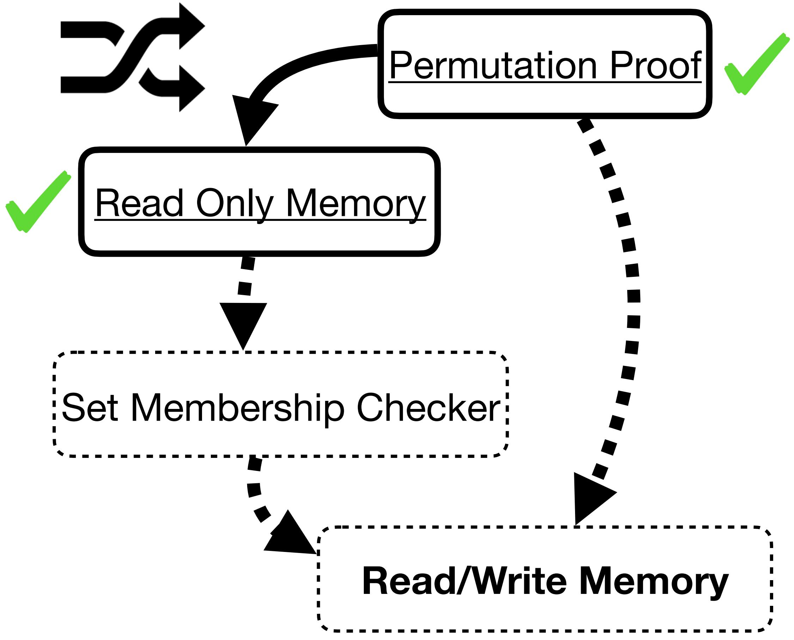

flowchart

```mermaid
graph TD
    A["Read Only Memory"] --> B["Set Membership Checker"]
    B --> C["Read/Write Memory"]
    C --> D["Permutation Proof"]
    D --> E["✓"]
    E --> A
```

# Evaluation

We implemented in the VOLE-based ZK setting [DIO21, YSWW21]

\~600K random accesses per second on a 1 Gbps LAN

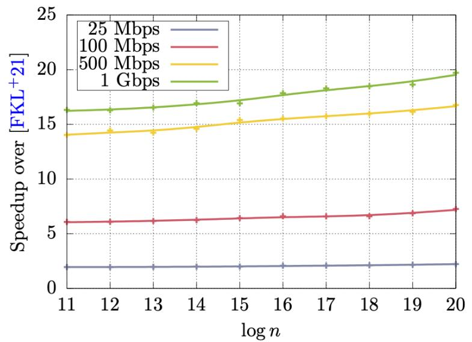

line

| log n | 25 Mbps | 100 Mbps | 500 Mbps | 1 Gbps |
|-------|---------|----------|----------|--------|
| 11    | 2.0     | 6.0      | 14.0     | 16.0   |
| 12    | 2.0     | 6.0      | 14.2     | 16.2   |
| 13    | 2.0     | 6.0      | 14.3     | 16.4   |
| 14    | 2.0     | 6.2      | 14.5     | 16.8   |
| 15    | 2.0     | 6.3      | 15.0     | 17.2   |
| 16    | 2.0     | 6.5      | 15.3     | 17.8   |
| 17    | 2.0     | 6.6      | 15.5     | 18.2   |
| 18    | 2.0     | 6.7      | 15.7     | 18.5   |
| 19    | 2.0     | 6.9      | 16.0     | 18.8   |
| 20    | 2.0     | 7.2      | 16.5     | 19.5   |

Figure 12: Speedup of our RAM over [FKL+21]'s RAM.

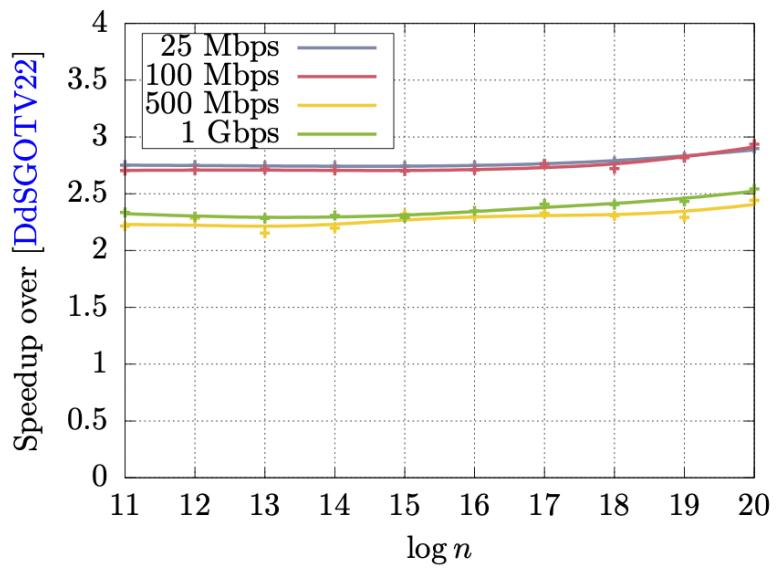

line

| log n | 25 Mbps | 100 Mbps | 500 Mbps | 1 Gbps |
|-------|---------|----------|----------|--------|
| 11    | 2.7     | 2.7      | 2.2      | 2.3    |
| 12    | 2.7     | 2.7      | 2.2      | 2.3    |
| 13    | 2.7     | 2.7      | 2.1      | 2.3    |
| 14    | 2.7     | 2.7      | 2.1      | 2.3    |
| 15    | 2.7     | 2.7      | 2.2      | 2.3    |
| 16    | 2.7     | 2.7      | 2.3      | 2.3    |
| 17    | 2.7     | 2.7      | 2.3      | 2.4    |
| 18    | 2.7     | 2.7      | 2.3      | 2.4    |
| 19    | 2.8     | 2.8      | 2.3      | 2.4    |
| 20    | 2.9     | 2.9      | 2.4      | 2.5    |

Figure 15: Our RAM's speedup over [DdSGOTV22]'s RAM (we optimize [DdSGOTV22]'s RAM).

# Thank you!

# Q&A

text_image

ARTIFACT
EVALUATED
usenix®
ASSOCIATION
AVAILABLE

text_image

ARTIFACT EVALUATED
usenix® ASSOCIATION
FUNCTIONAL

text_image

ARTIFACT EVALUATED
usenix® ASSOCIATION
REPRODUCED

yyang811@gatech.edu

ePrint: https://eprint.iacr.org/2023/1115   
• GitHub: https://github.com/gconeice/improved-zk-ram